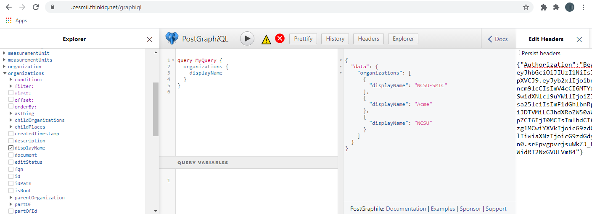
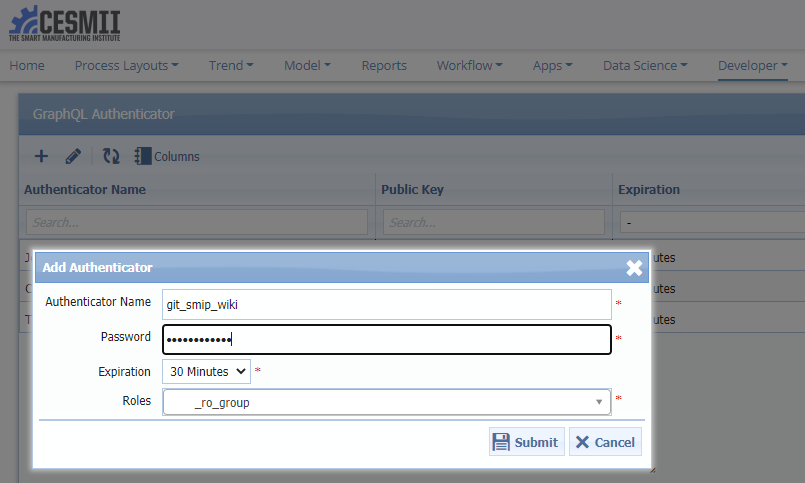

# Acquiring a JSON Web Token (JWT)

## Introduction

CESMII's Smart Manufacturing Innovation Platform™ (SMIP™, or "the platform" for short) provides a rich toolset of APIs to programatically interact with pages, model, and process data. The toolset includes a GraphQL API that can be accessed and explored interactively from within the platform as well as remotely using standard web requests. Both approaches require HTTP requests to carry an Authorization header with a bearer token. 

This document explains how to obtain such tokens, first interactively from within the platform, then from outside using a desktop client application. We are accessing three menu items available in the platform: 

- GraphQL - Request Header Token *to obtain a JWT token*
- GraphiQL *to interactively explore the GraphQL API*
- Authenticators *to manage and register authenticators for remote access*

## Exploring the SMIP GraphQL API interactively from within the platform

### Obtain a JWT token interactively

The platform contains a simple feature to obtain an Authentication token, typically found under Developer -> GraphQL - Request Header Token. The result is a JSON object that looks like this:

Feel free to take the token to a jwt decoder, such as https://jwt.ms to inspect its content. To progress with GraphQL, simply select and copy the complete output, for we'll need it in the next step. Also keep in mind that by default the tokens are good for 30mins. This is a platform parameter, which can be adjusted in the administrator section of the application.

Note: If you can't find this menu item it can be created as a URL-type menu item in the administrator section of the platform with the following Link: */api/graphql/?authorizationHeader=1*

### Interactively explore the SMIP GraphQL API

We are now ready to access and explore the GraphQL API via Developer -> GraphiQL. GraphiQL is one of the most commonly used GraphQL clients available, and the platform neatly embedds it right into the user experience. The page should look like shown below. The first thing we need to do is expand the headers pane shown on the very right of the image and paste the authentication JSON object with the JWT token we copied in the step above. The button to toggle the headers pane is located either in the button row on top or next to the Query Variables on the bottom of the page.

The platform uses PostGraphile to expose our model as GraphQL and the GraphiQL UI features an Explorer, shown on the left of the screen, which makes it easy to browse the schema and build queries. The schema includes queries for data retrieval, Mutations to update and create data, and Subscriptions to obtain data as it changes in real-time. The example query shown in the image below is created by simply browsing in the Explorer, expanding "organizations" and checking the "displayName" property. Use conditions and filters to create complex filtered queries. You can traverse the model, for instance by expanding the "childPlaces" dropdown to produce a nested JSON tree as an output.

Note: If you can't find this menu item it can be created as a URL-type menu item in the administrator section of the platform with the following Link: *graphiql*

## Accessing the SMIP GraphQL API remotely

The main benefit of the SMIP GraphQL API is that it can be accessed from outside of the web application. In this section we will use a desktop GraphiQL client to first obtain a JWT token and then make remote queries across the web. [GraphiQL](https://www.electronjs.org/apps/graphiql) can be downloaded as a light-weight electron app client for multiple operating systems, including Windows, Mac, and Linux. In this tutorial we will be using the [Altair GraphQL Client](https://www.electronjs.org/apps/altair).

You can perform all of these actions programmatically, see the [Samples folder](https://github.com/cesmii/API/tree/main/Samples) for details in a variety of programming languages.

### Check if you have an Authenticator in Place

Before we can obtain JWT tokens from the platform we need to configure a so called authenticator. Basically we need to register our client apps with the platform and assign them an appropriate GraphQL role. This is a common workflow to allow daemon style application interoperabilty - using application permissions rather then operating on behalf of a signed-in user.

Let's register an authenticator named "git_smip_wiki" with the secret "git_password" and assign the read-only role "YOURINSTANCE_ro_group" via Developer -> Authenticators:

In other authentication management portals the Authenticator Name / Password combo is often referred to as application id and application secret. Make sure to take notice of the secret, for it won't be revealed in clear text - only a hash gets saved in the platform. You'll notice the roles is a dropdown where multiple choices can be made. Be mindful in following good practices and only assign permissions matching your use case. 

Note: If you can't find this menu item it can be created as a URL-type menu item in the administrator section of the platform with the following Link: *index.php?option=com_modeleditor&view=graphql_authenticator*. Alternatively you can choose the Menu Item Type as *Model Editor -> GraphQL Authenticator* and end up with the same link.

### Obtain a JWT token using a desktop client and make requests

We can obtain a JWT token from the platform by performing a sequence of 2 GraphQL Mutation calls, which will return a one-time challenge string, and a JWT token, respectively. The Mutations are the AuthenticationRequest and the AuthenticationValidation, and both can be performed anonymously.

The SMIP GraphQL API endpoint can be reached by adding a */GraphQL* to your SMIP home url. Also, GraphQL allows [Introspection](https://graphql.org/learn/introspection/) queries, which is a fantastic way to explore the schema in the clients "Docs" feature, pictured on the right side of the screen shots below.

1) AuthenticationRequest

In this first step we use the authenticator name, the role, and a user name to obtain a challenge phrase.

~~~ cURL
curl 'https://YOURINSTANCE.cesmii.thinkiq.net/graphql' -H 'Accept-Encoding: gzip, deflate, br' -H 'Content-Type: application/json' -H 'Accept: application/json' -H 'Connection: keep-alive' -H 'Origin: altair://-' --data-binary '{"query":"mutation {\n  authenticationRequest(\n    input: {\n      authenticator: \"git_smip_wiki\"\n      role: \"ncsu_ro_group\"\n      userName: \"TestUser\"\n    }\n  ) {\n    clientMutationId\n    jwtRequest {\n      challenge\n      message\n    }\n  }\n}\n","variables":{}}' --compressed
~~~

2) AuthenticationValidation

In the second step we use the callenge phrase signed with our secret (the challenge, then a pipe, then the secret - i.e. $\`{challenge}|{secret}\`), and the authenticator name to obtain a JWT token string.

~~~ cURL
curl 'https://YOURINSTANCE.cesmii.thinkiq.net/graphql' -H 'Accept-Encoding: gzip, deflate, br' -H 'Content-Type: application/json' -H 'Accept: application/json' -H 'Connection: keep-alive' -H 'Origin: altair://-' --data-binary '{"query":"mutation {\n  authenticationValidation(\n    input: {\n      signedChallenge: \"<<challenge string here>>|git_password\"\n      authenticator: \"git_smip_wiki\"\n    }\n  ) {\n    jwtClaim\n  }\n}\n","variables":{}}' --compressed
~~~

3) SMIP GraphQL API request

Finally we can add the Authorization header with our Bearer JWT token to make a SMIP GraphQL API request.

~~~ cURL
curl 'https://YOURINSTANCE.cesmii.thinkiq.net/graphql' -H 'Accept-Encoding: gzip, deflate, br' -H 'Content-Type: application/json' -H 'Accept: application/json' -H 'Connection: keep-alive' -H 'Origin: altair://-' -H 'Authorization: Bearer eyJhbGc<< your JWT token here >>9xlC3gM' --data-binary '{"query":"{\n  organizations {\n    displayName\n    childPlaces {\n      displayName\n    }\n  }\n}\n","variables":{}}' --compressed
~~~

# Conclusion

This concludes the overview of making SMIP GraphQL API calls using JWT tokens. We hope you find this information useful. Contact your project sponsors for any additional questions you may have.