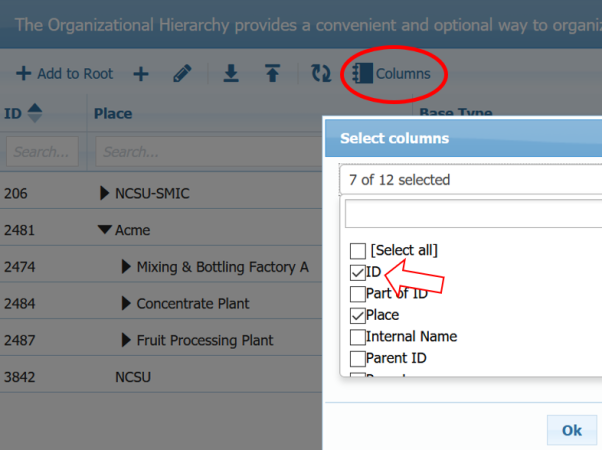

# SMIP Mutations

In GraphQL, the endpoint is always the same, but the query payload changes to indicate the response payload you wish to retrieve. Updates and Insertions are called Mutations, and are performed against the same endpoint as queries. For more information on accessing the GraphQL endpoint for your SMIP instance, see the page [SMIP GraphQL Endpoint](smip-graphql.md).

## Finding IDs

In these examples, you need to know the ID of the element you are mutating. You can find IDs through [GraphQL Queries](queries.md), but it is also available in the UI by turning on the ID column in any table view:




## Example Mutations

**<a name="time-series">Mutating Time Series Sample Values**

The following query payload mutates time series sample values for a given Instance Attribute Tag, with the provided time stamp. If values already exist, they will be updated (replaced). If values did not previously exist, they will be inserted:

```
mutation MyTimeSeriesMutation {
  replaceTimeSeriesRange(
    input: {
      attributeOrTagId: "##"
      entries: [
        { timestamp: "2021-02-02T02:00:00Z", value: "1.5", status: "1" }
        { timestamp: "2021-02-02T03:00:00Z", value: "2.5", status: "1" }
        { timestamp: "2021-02-02T04:00:00Z", value: "3.5", status: "1" }
      ]
      startTime: "2021-02-02"
      endTime: "2021-02-03"
    }
  ) {
    clientMutationId
    json
  }
}
```

Replace ## with your tag or attribute ID.

**<a name="create-tag">Creating New Tags**

```
mutation CreateTag_Mutation {
  createTag(
    input: {
      tag: {
        dataType: FLOAT
        relativeName: "NewTagName"
        displayName: "NewTagName"
        partOfId: "##"
      }
    }
  ) {
    clientMutationId
    tag {
      id
      displayName
      systemType
    }
    asThing {
      id
      displayName
      systemType
    }
  }
}
```

Replace ## with the ID of the connector you want to attach the tag to.

## Other Operations

Read only operations, called Queries, are performed against the same endpoint. Some  [Query examples can be found here](queries.md).