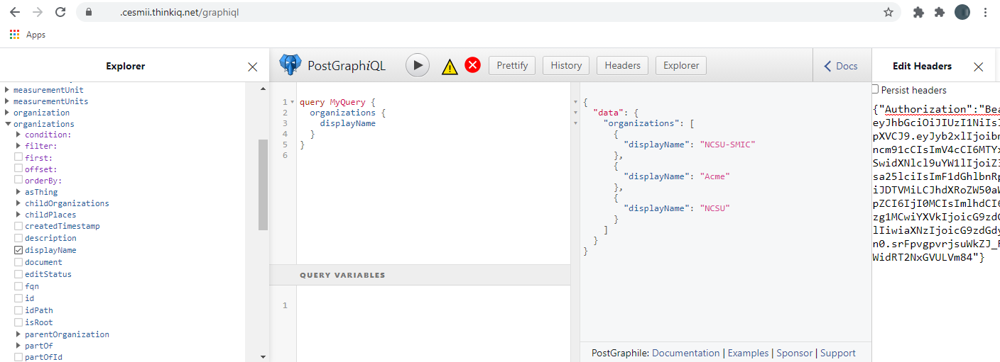

# Acquiring a JSON Web Token (JWT)

## Introduction

CESMII's Smart Manufacturing Innovation Platform™ (SMIP™, or "the platform" for short) provides a rich toolset of APIs to programatically interact with pages, model, and process data. The toolset includes a GraphQL API that can be accessed and explored interactively from within the platform as well as remotely using standard web requests. Both approaches require HTTP requests to carry an Authorization header with a bearer token. 

This document explains how to obtain such tokens, first interactively from within the platform, then programatically from outside. We are accessing three menu items available in the platform: 

- GraphQL - Request Header Token *to obtain a JWT token*
- GraphiQL *to interactively explore the GraphQL API*
- Authenticators *to manage and register authenticators for remote access*

## Exploring the SMIP GraphQL API interactively from within the platform

### Obtain a JWT token interactively

The platform contains a simple feature to obtain an Authentication token, typically found under Developer -> GraphQL - Request Header Token. The result is a JSON object and look like this:

Feel free to take the token to a jwt decoder, such as https://jwt.ms to inspect its content. To progress with GraphQL, simply select and copy the complete output, for we'll need it in the next step.

Depending on the setup, this menu item may be else where. If this menu item can't be found it can be created as a URL-type menu item in the administrator section of the platform with the following Link: */api/graphql/?authorizationHeader=1*

### Interactively explore the SMIP GraphQL API

We are now ready to access and explore the GraphQL API via Developer -> GraphiQL. GraphiQL is one of the oldest and most commonly used GraphQL clients around, and the platform neatly embedds it right in the system. The page should look like shown below. The first thing we need to do is expand the headers pane shown on the very right of the image and paste the authentication JSON object with the JWT token we copied in the step above. The button to toggle the headers pane is located either in the button row on top or next to the Query Variables on the bottom of the page.

The platform uses PostGraphile to expose our model as GraphQL and the GraphiQL UI features an Explorer, shown on the left of the screen, which makes it easy to browse the schema and build queries. The schema includes queries for data retrieval, Mutations to update and create data, and Subscriptions to obtain data as it changes in real-time. The example query shown in the image below is created by simply browsing in the Explorer, expanding "Organizations" and checking the "displayName" property. Use conditions and filters to create complex filtered queries. You can traverse the model, for instance by expanding the "childPlaces" dropdown to produce a nested JSON tree.

If your GraphiQL menu item can't be found, it can be created as a URL-type menu item in the administrator section of the platform with the following Link: *graphiql*

## Accessing the SMIP GraphQL API remotely

### Check if you have an Authenticator in Place

### Programatically obtain a JWT token and make requests
